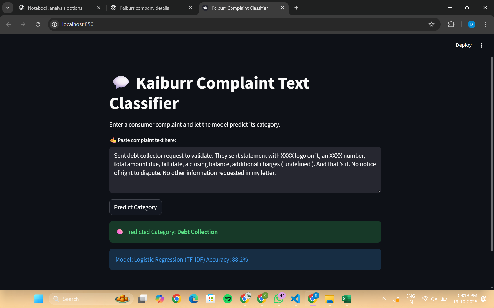
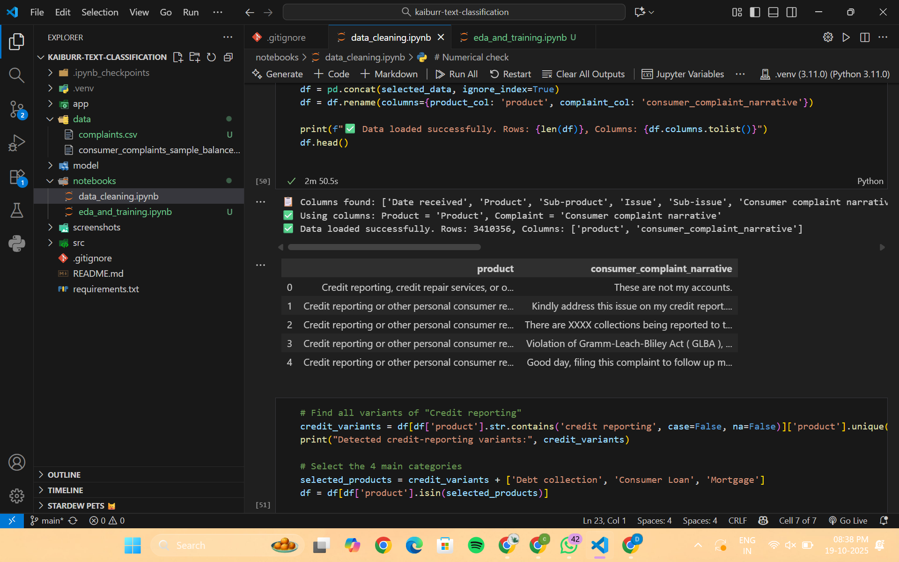
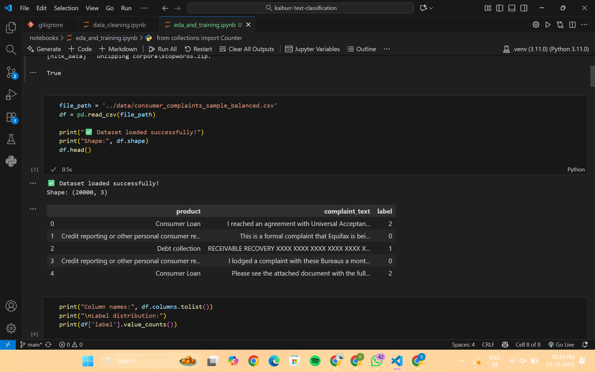
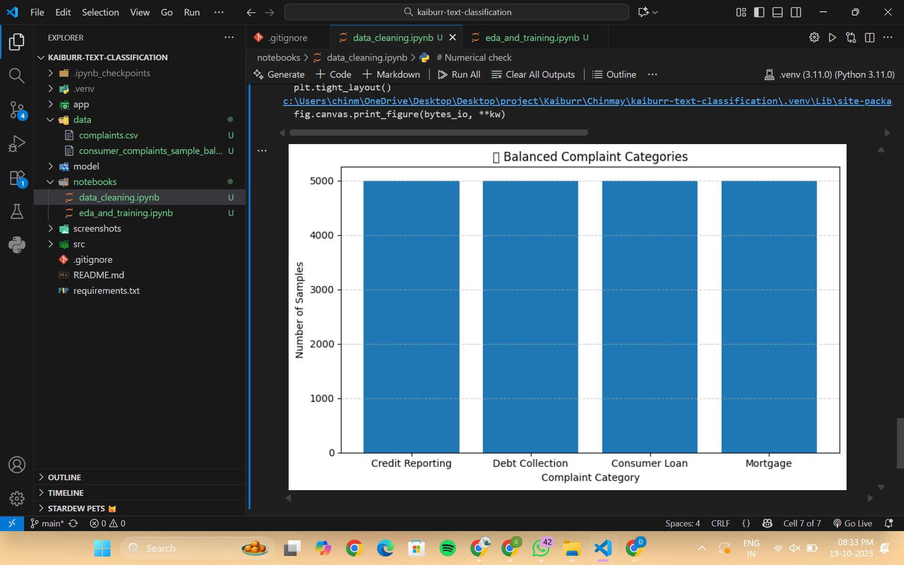
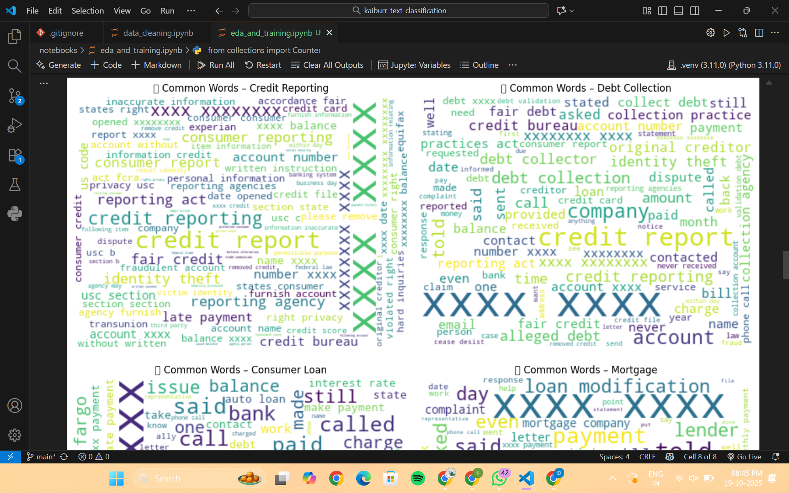
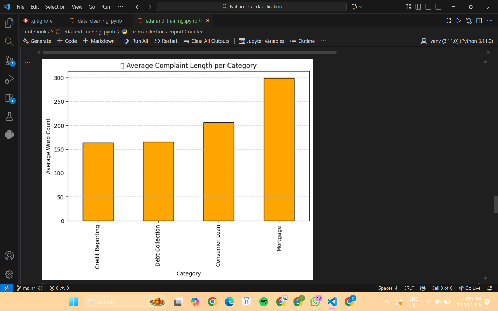
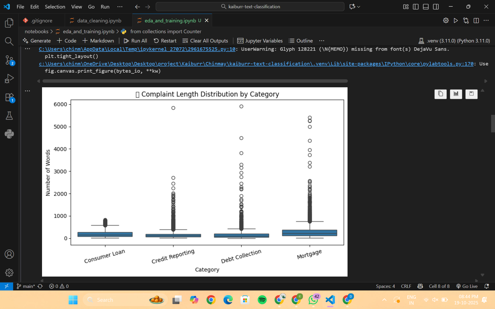
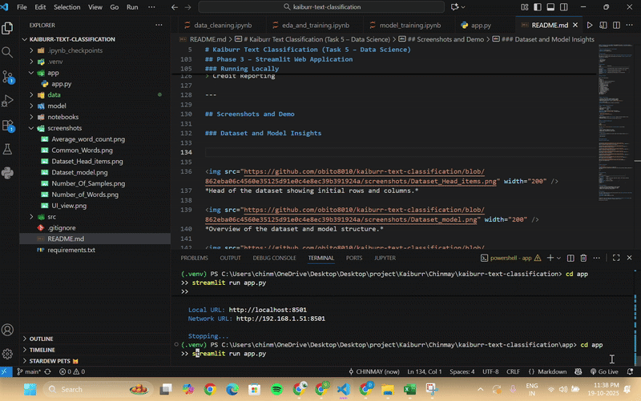

# Kaiburr Text Classification

A Machine Learning based text classification application that classifies user-provided text into predefined categories using Natural Language Processing (NLP) techniques. The project uses TF-IDF feature extraction and machine learning models to perform text classification and provides an interactive interface using Streamlit.

## 🚀 Features

* Text preprocessing and cleaning
* NLP-based feature extraction using TF-IDF Vectorization
* Machine learning model training and evaluation
* Text classification through an interactive web interface
* Streamlit-based user-friendly application
* Saved trained model and vectorizer for faster predictions

## 🛠️ Technologies Used

* Python
* Streamlit
* Scikit-learn
* Pandas
* NumPy
* NLTK
* Joblib
* Machine Learning
* Natural Language Processing (NLP)

## 📂 Project Structure

```
kaiburr-text-classification/
│
├── app/
│   └── app.py                 # Streamlit application
│
├── model/
│   ├── tfidf_vectorizer.pkl   # Saved TF-IDF vectorizer
│   └── logistic_regression_model.pkl  # Trained classification model
│
├── data/
│   └── Dataset files
│
├── notebooks/
│   ├── data_cleaning.ipynb
│   ├── eda_and_training.ipynb
│   └── model_training.ipynb
│
├── screenshots/
│
├── requirements.txt
└── README.md
```

## ⚙️ Installation and Setup

### 1. Clone the repository

```bash
git clone https://github.com/obito8010/kaiburr-text-classification.git
```

### 2. Navigate to the project directory

```bash
cd kaiburr-text-classification
```

### 3. Install dependencies

```bash
pip install -r requirements.txt
```

## ▶️ Running the Application

Navigate to the app folder:

```bash
cd app
```

Run the Streamlit application:

```bash
streamlit run app.py
```

The application will open in your browser at:

```
http://localhost:8501
```

## 🧠 Machine Learning Workflow

1. Data collection and preprocessing
2. Text cleaning and normalization
3. Feature extraction using TF-IDF
4. Model training and evaluation
5. Saving the trained model using Joblib
6. Deploying the model through Streamlit

## 📊 Models Used

The project experiments with multiple machine learning algorithms:

* Logistic Regression
* Naive Bayes
* Random Forest

The best-performing model is saved and used for prediction.

## 📸 Application Preview

## 📸 Application Preview

<p align="center">
  
</p>

<p align="center">
  
  
</p>

<p align="center">
  
  
</p>

<p align="center">
  
  
</p>

<p align="center">
  
</p>

## 👩‍💻 Author

Developed as a Machine Learning and NLP based project.
